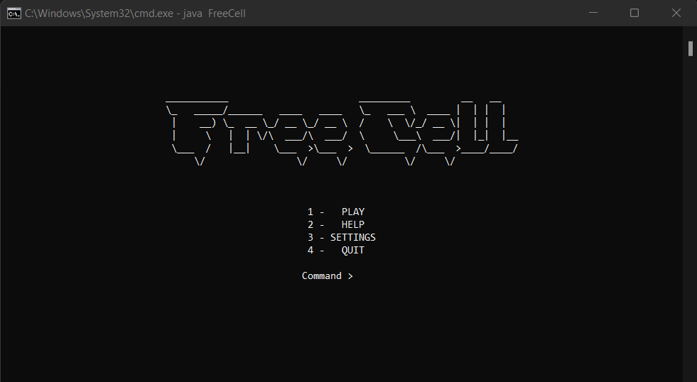
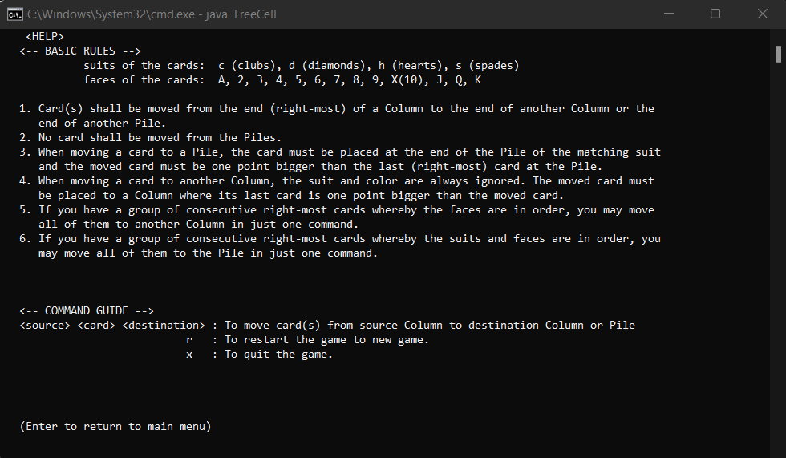
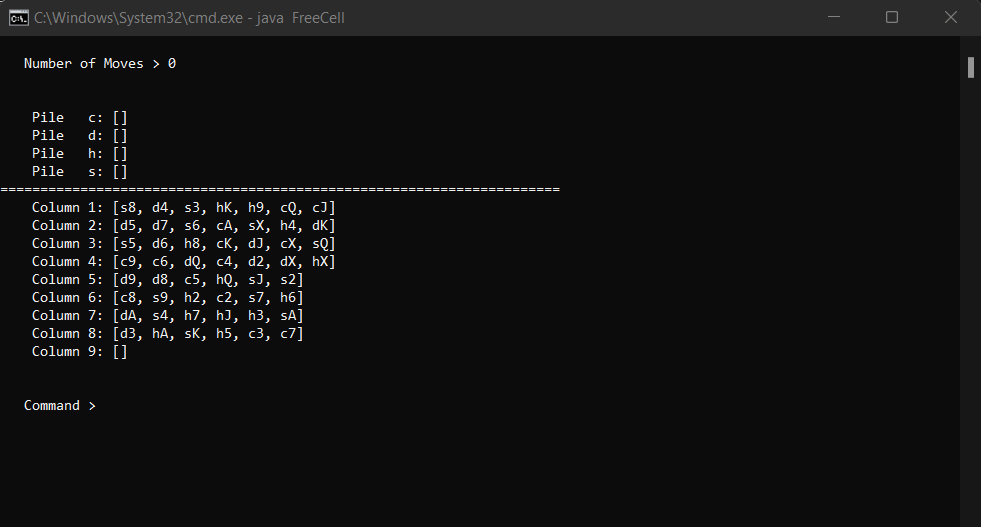
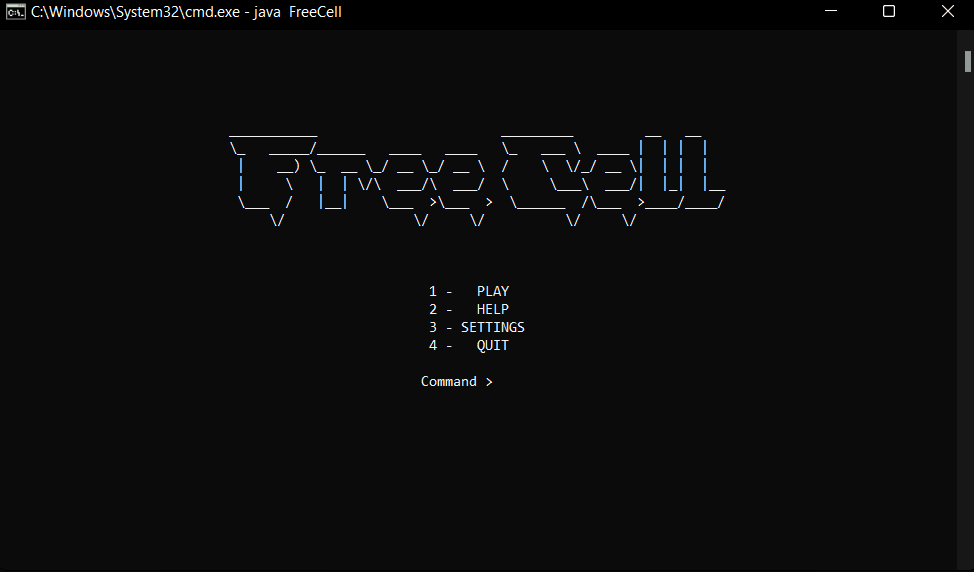

# FreeCell

Simple FreeCell game on terminal written in Java. 

Written for Year 1 OOPDS Assignment in Trimester 2 2019/2020.

[Assignment Question](question/OOPDS_Assignment.pdf)

## Running the program

1. Clone this repo 

   ```
   git clone https://github.com/BingQuanChua/FreeCell.git
   ```

2. Traverse into the cloned directory

   ```
   cd FreeCell
   ```

2. Compile all Java files

   ```
   javac *.java
   ```

3. Run the main program

   ```
   java FreeCell
   ```

## Screenshots







<br>

Demo: